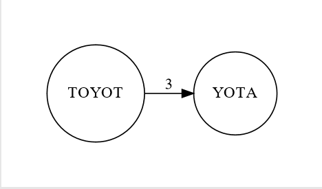

# Graph Visualization

An overlap graph is a directed graph in which each string in a collection is represented by a node and node 's' is connected to 't' with a directed edge if some suffix of s equals a prefix of t.

We assume that the two substrings are longer than some predetermined threshold 'k' to prevent noise in the graph.

Here in the file overlap_graph you can find relations between the nodes for 3 or k length of equal suffix and prefix. The rosalind_graph.txt has all the sequences in fasta format. The graph created has a number on top of each edge indicating the value of k. I am using [graphviz][1] library to generate a dot file that will generate the graph. 

I will recommend using the file "rosalind_grph.txt" to generate the graph as the sequences are short.
Some outputs:

The code for representing nodes in circular fashion is in the directory "circular graph". 

In the future I need to make a animation for showing the genome assembly.

<!-- references -->
[1]: https://graphviz.readthedocs.io/en/stable/
